# Monibuca 可视化实例管理器

# 快速起步

## 项目地址

[https://github.com/Monibuca](https://github.com/Monibuca)

## 主页

[https://monibuca.com](https://monibuca.com)

## 介绍
**Monibuca** 是一个开源的流媒体服务器开发框架，适用于快速定制化开发流媒体服务器，可以对接CDN厂商，作为回源服务器，也可以自己搭建集群部署环境。
丰富的内置插件提供了流媒体服务器的常见功能，例如 rtmp server、http-flv、视频录制、QoS等。除此以外还内置了后台web界面，方便观察服务器运行的状态。
也可以自己开发后台管理界面，通过api方式获取服务器的运行信息。
**Monibuca** 提供了可供定制化开发的插件机制，可以任意扩展其功能。

## 安装 和启动 monica

执行下面的命令即可（mac或者linux系统请以 root 身份运行）

```sh
npm i -g @langhuihui/monica
monica
```

:::tip
**提示 npm 命令需要安装好nodejs：**<br>
进入[官网](https://nodejs.org/en/ )下载和安装即可

**mac电脑如何进入 root 身份：**<br>
[https://www.jianshu.com/p/f5e09261a064](https://www.jianshu.com/p/f5e09261a064) ，按照链接教程设置好后，在终端执行 su root 然后再执行 monica 命令 启动实例管理器
:::

启动后，打开 [http://localhost:3000](http://localhost:3000) 会看到下面的界面

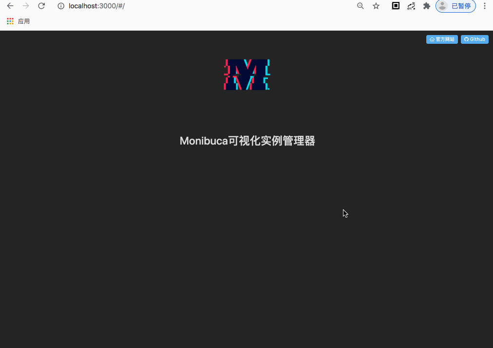

这就是创建实例管理器的欢迎页面，它会帮助你检查你本地的 `go` 环境是否正确配置。

**如果没有正确配置 `go` 环境，请先配置好 `go` 环境，在点击下一步进行实例创建和管理。如果配置了 `go` 环境，请确保 `go version >= 1.13` 然后再点击下一步。**

## go 代理设置
如果服务器在国内无法访问 `golang.org` 等域名的情况下，需要配置 `GOPROXY` 环境变量
```bash
go env -w GOPROXY="https://goproxy.io,direct"
```

## 实例创建

### step1 进行实例管理页面

点击下一步后，进入实例管理页面，展示如下图：

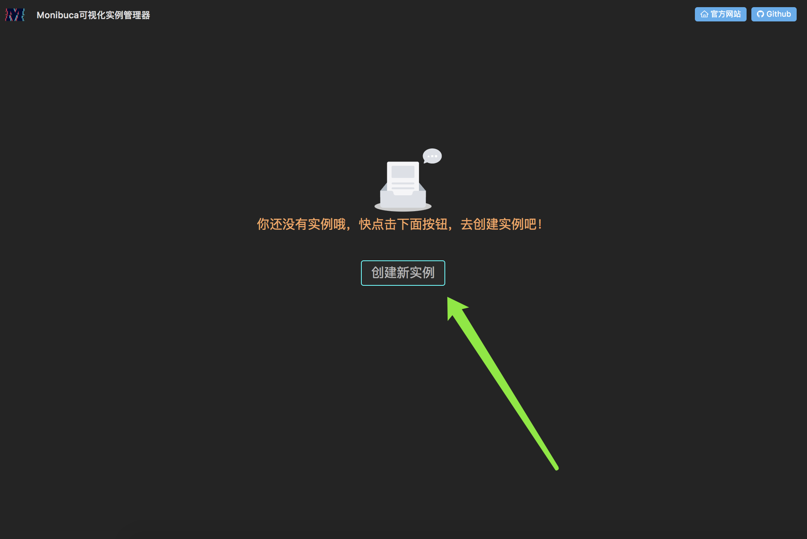

这时，你会发现，你还没有创建的实例，你需要点击 **创建新实例** 按钮进行创建实例

### step2 创建实例

点击 **创建新实例** 按钮进行实例创建，创建界面如下图所示：

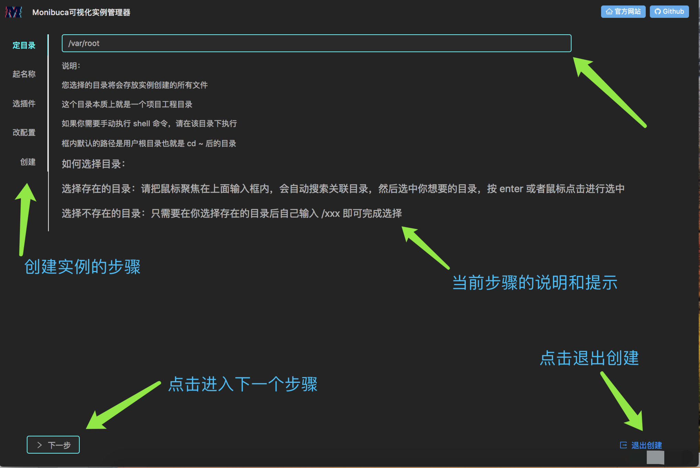

图中的各个模块已经用箭头加文字进行了说明。这里我们来进行一次实例创建。大家请往下看：


### step2-1 定目录

鼠标聚焦在输入框时，就会进行路径联想，并把联想结果显示出来，如下图所示：

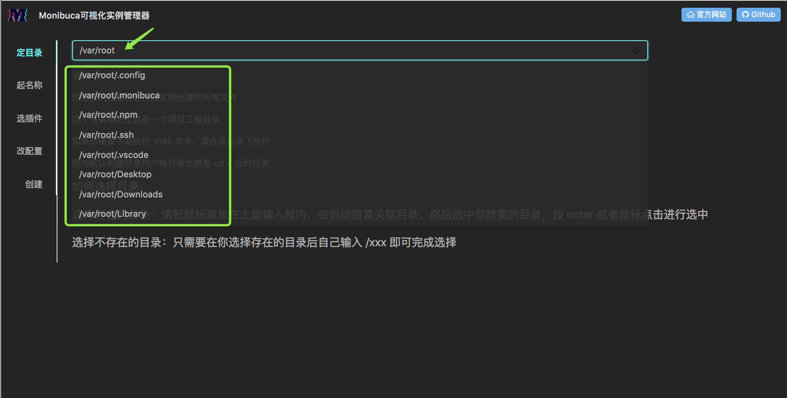

> 这里，默认填充目录是用户根目录，也就是 `cd ~` 所在的目录。

选择目录规则：**大家可以选择目录，可以选择存在的目录路径，也可以选择不存在的目录路径，如果是不存在目录路径，创建器会自动新建目录。**

如，我们选择了不存在的目录路径，是 `/var/root/yk-kaiyuan/root-test-6` ，如下图所示： 

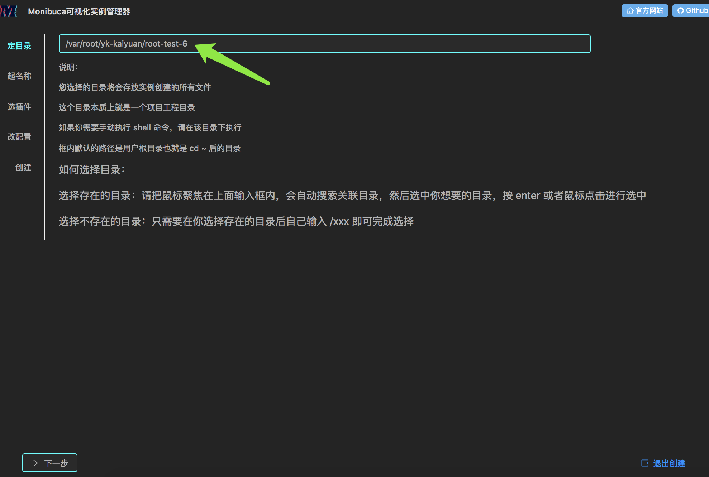

至此我们的实例目录就确定好了，下面开始确定实例名称

### step2-2 起名称

点击下一步或者直接点击起名称，会进入起名称步骤，如下图所示：


这里会自动把实例目录名充到实例名称名上，一般情况下不需要做修改，如果想修改，可以直接在输入框中进行修改实例名称。

:::tip
**创建的实例名称是不能重复的**，比如你创建了 `10` 个实例，那这 `10` 个实例的名称是不可以重复的，必须保证是唯一的。
:::

### step2-3 选插件

点击下一步或者直接点击选择插件，会进入选插件步骤，如下图所示：

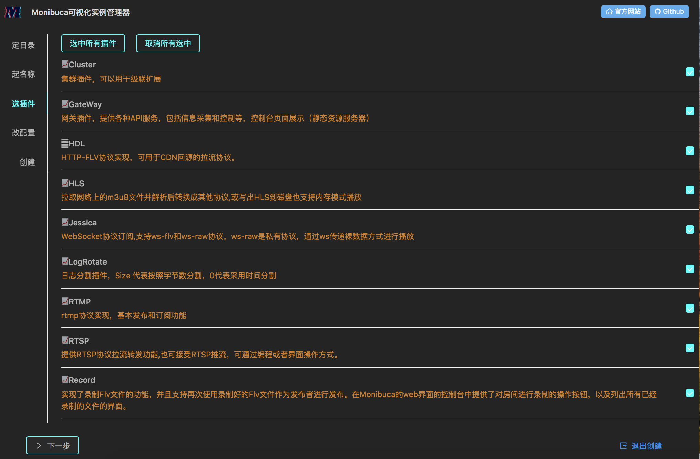

这里会自动选中常用的插件，建议不做修改，全部采用默认的选择，如果你是新手，更应该如此，此处不要做改动，直接使用默认选择。

### step2-4 改配置

点击下一步或者直接点击改配置，会进入改配置步骤，如下图所示：

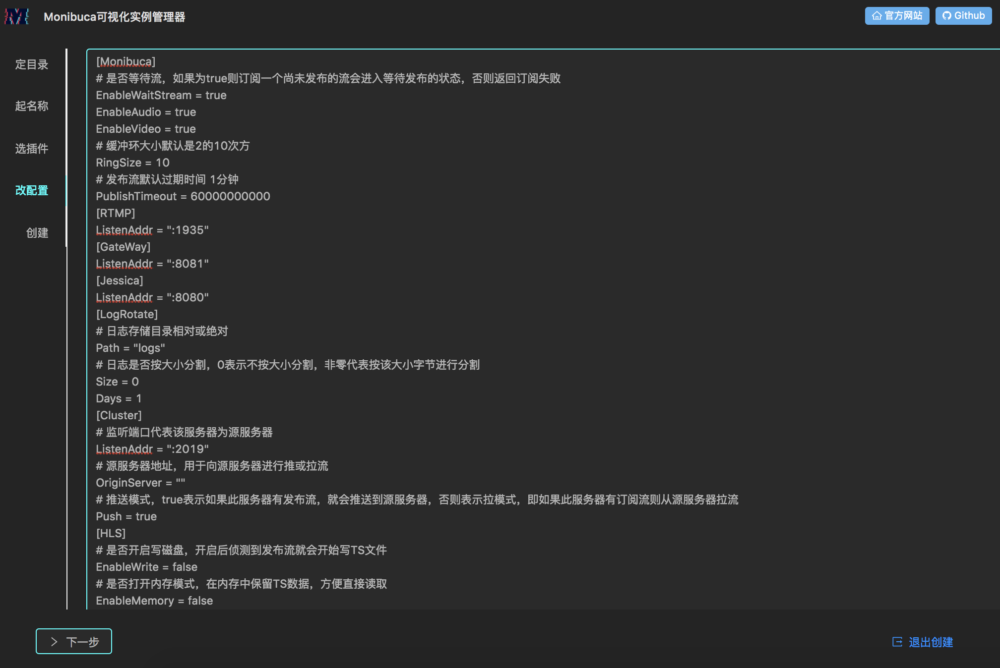

这里会自动填充默认的配置，如果这是你第一个创建的实例，建议不做修改，全部采用默认的配置。如果你是新手，更应该如此，此处不要做改动，直接使用默认配置。

### step2-5 创建

点击下一步或者直接点击创建，会进入创建步骤，如下图所示：

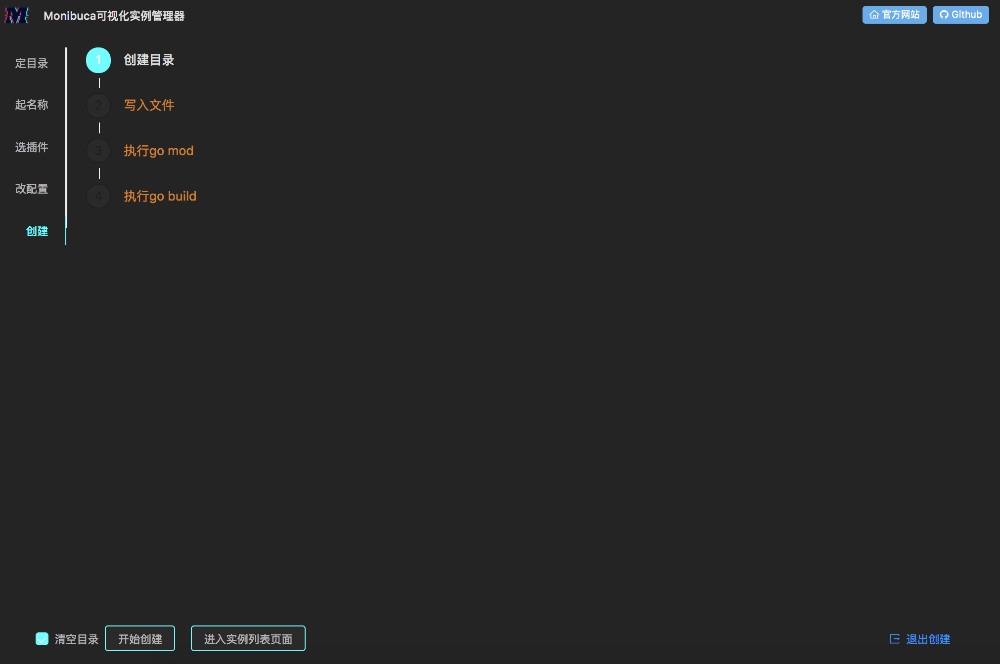

看上图，进入创建步骤后，点击下面 **开始创建** 按钮，进行实例的创建，点击 **开始创建**，出现下图：

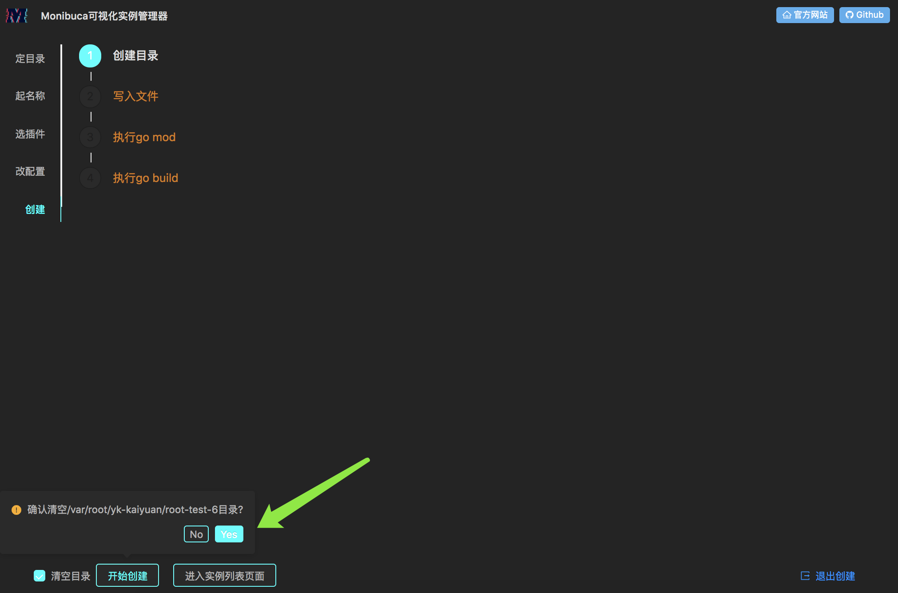

这时，注意有一个确认过程，提示你确认是否清空实例所在的目录，这里清空是用的 `rm -rf` 。**如果该目录本身就是空目录，则无所谓。否则，请确保你的实例目录不是根目录，确保实例目录可以清空。**

:::tip
1、如果不是空目录，同时不想清空目录，则需要把 **开始创建** 按钮左边的 清空目录勾选框取消勾选，即可。<br>
2、强烈建议采用新建的空目录去存放创建的实例。<br>
3、强烈建议不要使用根目录等重要目录去存放创建的实例。
:::

这里，我的是新建目录，所以点击 `Yes`  即可，点击后，即开始创建实例，创建过程如下动图演示：

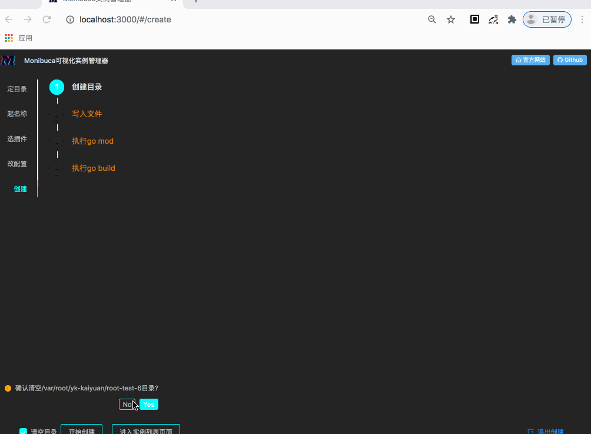

需要同时满足下面两个条件，才能表明实例创建成功：

第一个条件：在执行 `go build` 下，最后的信息会提示 `success` <br>
第二个条件：创建完成后，会有创建成功的 `toast` 提示

从上面动图可以得知，我们已经成功创建实例。至此，创建实例的整个过程已经阐述完了。下面我们将进入实例列表页面对实例进行各种操作。


## 实例管理


成功创建实例后，点击 **进入实例列表页面** 按钮进入实例列表页面，如下图所示：


会看到刚才创建的实例，已经在列表页面里了，大家一定很好奇，这个实例上的一些操作按钮是什么意识。别着急，只需要把鼠标移到操作按钮上面，就可以显示此操作按钮解释，下图是未启动时的操作按钮解释：

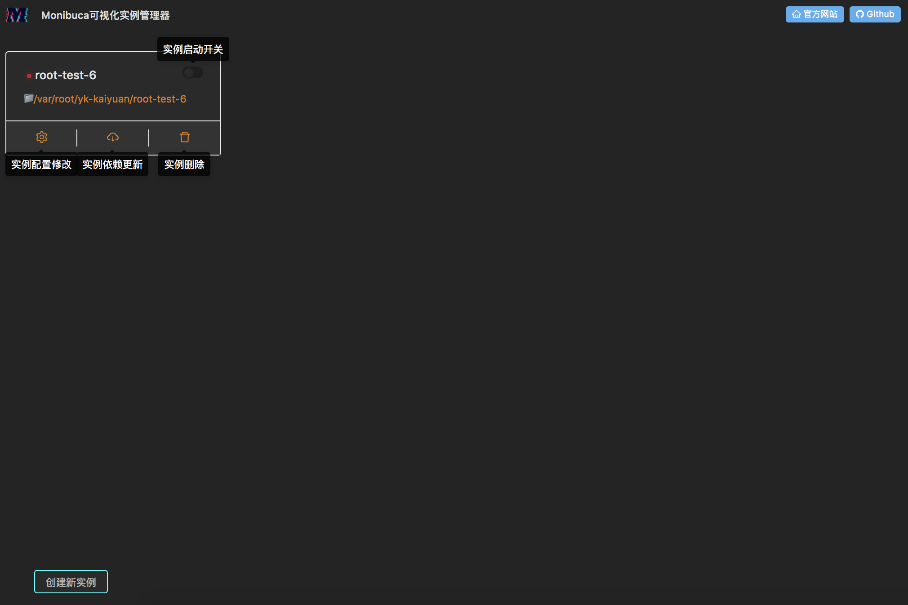

下面对这些操作按钮进行详细阐述：

### 实例配置修改

点击 **实例配置修改** 按钮，会出现下图所示的弹窗：

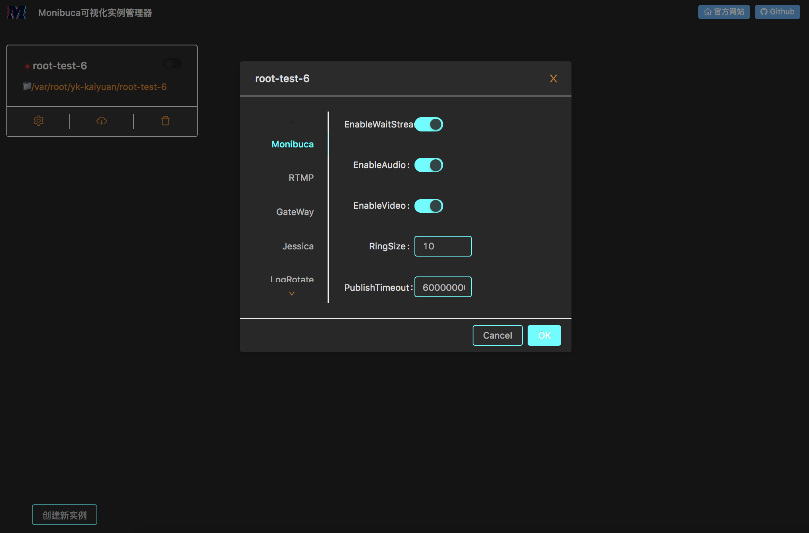

我们可以在此弹窗里面进行相关配置的修改，修改完后，点击 `OK` 即可完成配置修改。


### 实例依赖更新

点击 **实例依赖更新** 按钮，会出现下图所示的弹窗：

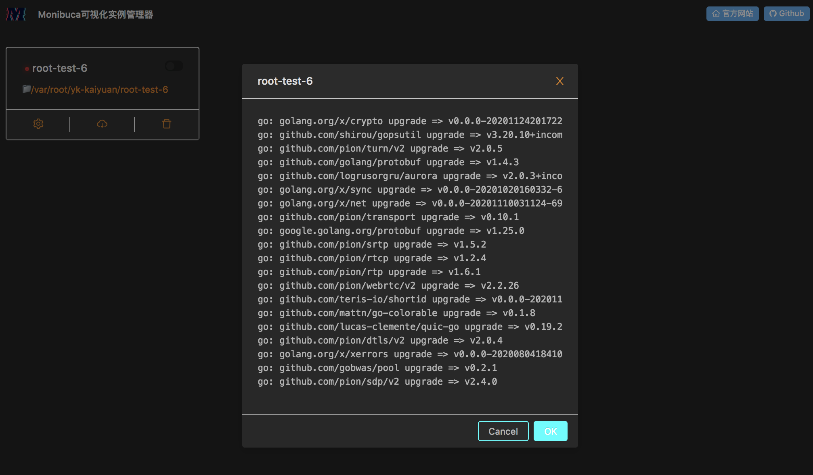

只要点击此按钮，就会开始自动更新依赖，更新完成后，点击`OK` 即可完成实例依赖更新。

### 实例删除

点击 **实例删除** 按钮，会出现下图所示的弹窗：


出现这个确认提示，大家应该都明白是啥意识了哈，点击 `Yes` 的话，就将进行实例删除操作。删除完成后，实例页面将不会显示该实例。

### 实例启动开关

在实例未开启状态下，点击 **实例启动开关** 按钮，会出现如下动图演示：

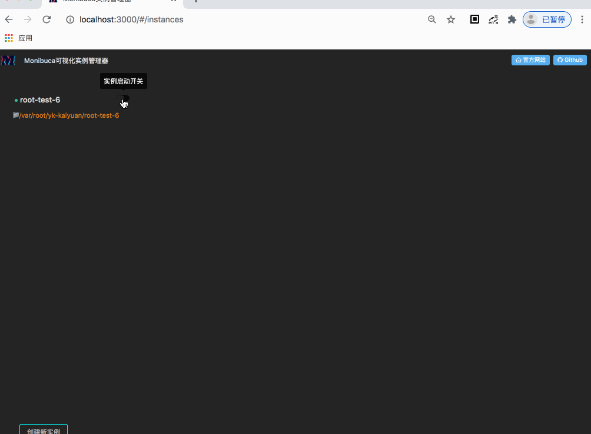

会发现，实例开启成功，也就是运行起来了，实例开启按钮由灰变成高亮，同时右侧出现创建实例成功提示，提示信息是底层创建的成功日志。

如果实例开启失败呢，开启失败的场景如下图所示：

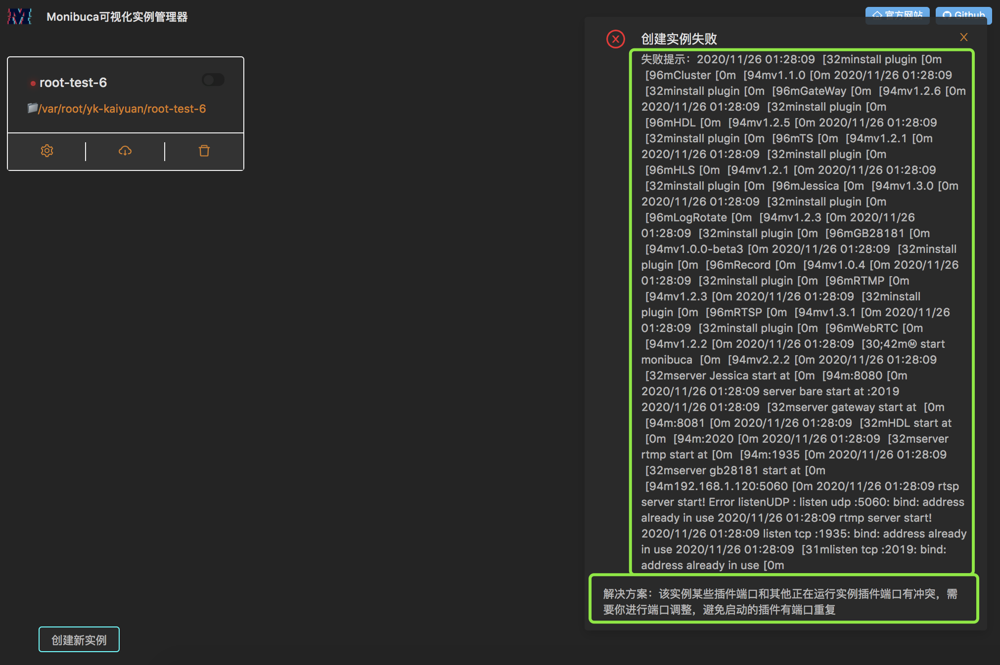

会发现，实例开启失败，实例开启按钮没有从灰变成高亮，同时右侧出现创建实例失败提示，提示信息是底层创建的失败日志，同时下面会有该实例开启失败的解决方案。大家请参考解决方案去解决实例开启失败的问题。

实例开启成功后，操作按钮会有变化，下图是启动成功后的操作按钮解释：

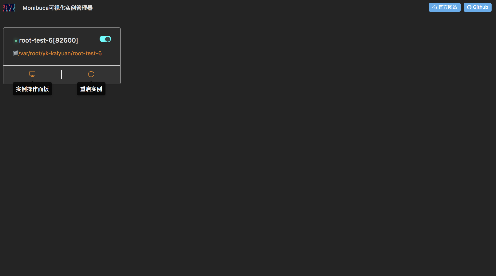

下面对这些操作按钮进行详细阐述：

### 重启实例

点击 **重启实例** 按钮，会出现下图所示的弹窗：


出现这个确认提示，大家应该都明白是啥意识了哈，点击 `Yes` 的话，就将进行实例重启操作

### 实例操作面板

点击 **实例操作面板** 按钮，会进入实例操作面板页面，如下图所示：

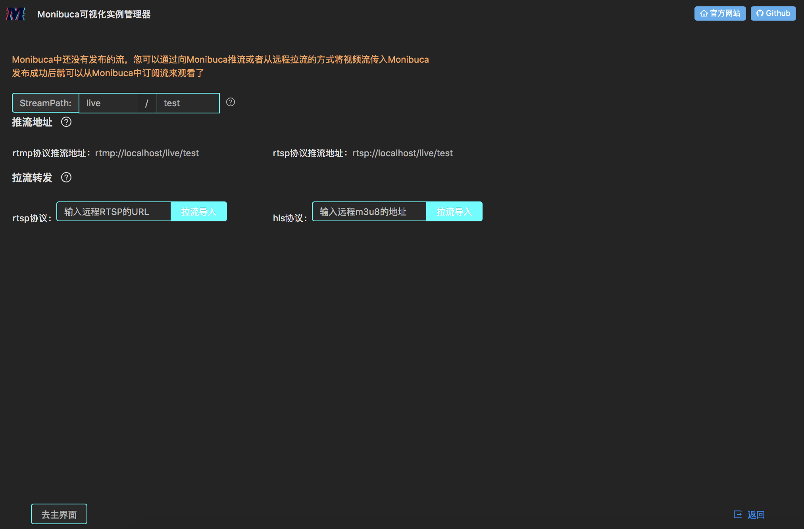

至此，实例管理的所有步骤已经阐述完了，下面我们将进入实例操作面板页面，进行实例操作教学

## 实例操作

下图展示的是实例操作面板页面：

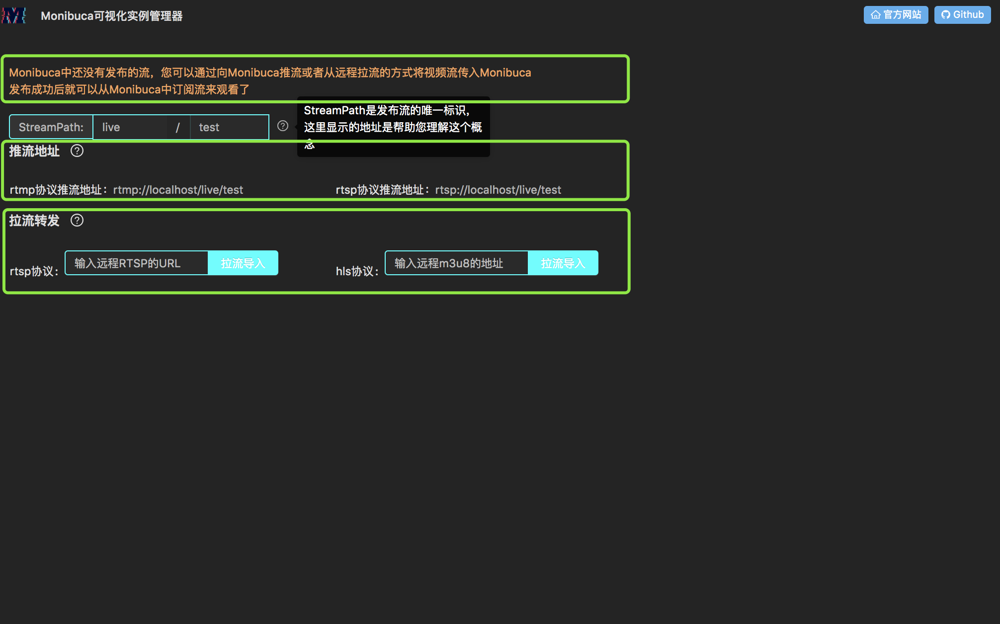

下面会对页面中的主要构成部分进行阐述：

### 提示语

大家可以看到如下提示语：

> **Monibuca** 中还没有发布的流，您可以通过向 **Monibuca** 推流或者从远程拉流的方式将视频流传入 **Monibuca**
发布成功后就可以从 **Monibuca** 中订阅流来观看了。

当我们看到这句话时，就表明现在还没有流推到 **Monibuca** ，我们可以通过一些工具将视频流传入到 **Monibuca** 中，然后再使用相应的播放器进行视频观看。

### StreamPath

`StreamPath` 是发布流的唯一标识，我们可以把它理解为网页的 `url` ，它是流传输服务中的 `url` 。你要发布一个流，就需要一个 `StreamPath` ，这里类比后端服务的发布，需要 	`ip` 和对外暴露的端口一起组成一个 `url` 。

### 推流地址

简单点说，就是这个实例开启后，你如果想往这个实例上推流，就需要将流推送到这个地址上。这样才能将流推到 **Monibuca** 。

**Monibuca** 接受 `ffmpeg` 、 `OBS` 等推流工具推流，这里要注意，**如果使用已存在的 `StreamPath` ，则会导致推流失败。**

### 拉流地址

简单点说，就是这个实例开启后，你可以用这个实例从外部拉流导入 **Monibuca** 。

主要构成部分已经介绍完了，下面我们举个例子来实践一下操作面板。


### 操作举例

使用 `ffmpeg` 往 该 **Monibuca** 实例上推流。

#### step1 下载 `ffmpeg` 

mac 和 windows 自行搜索下载

#### step2 推流

选择本地一个视频，命名为 `test.mp4` 。

在终端中，用 `cd` 进入该视频所在的目录下，执行下面命令：

```bash
sudo ffmpeg -re -stream_loop -1 -i test.mp4 -vcodec copy -acodec copy -f flv rtmp://localhost/live/test
```

会看到如下动图演示：

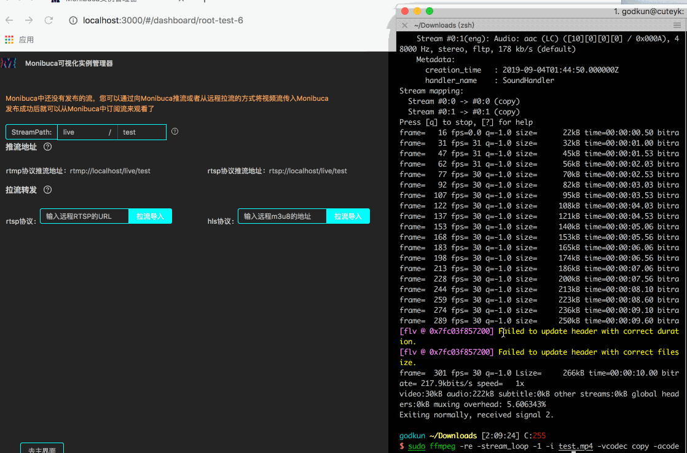

当执行命令后，我们会发现，实例操作面板页面发生了变化，变成了下图所示的样子：

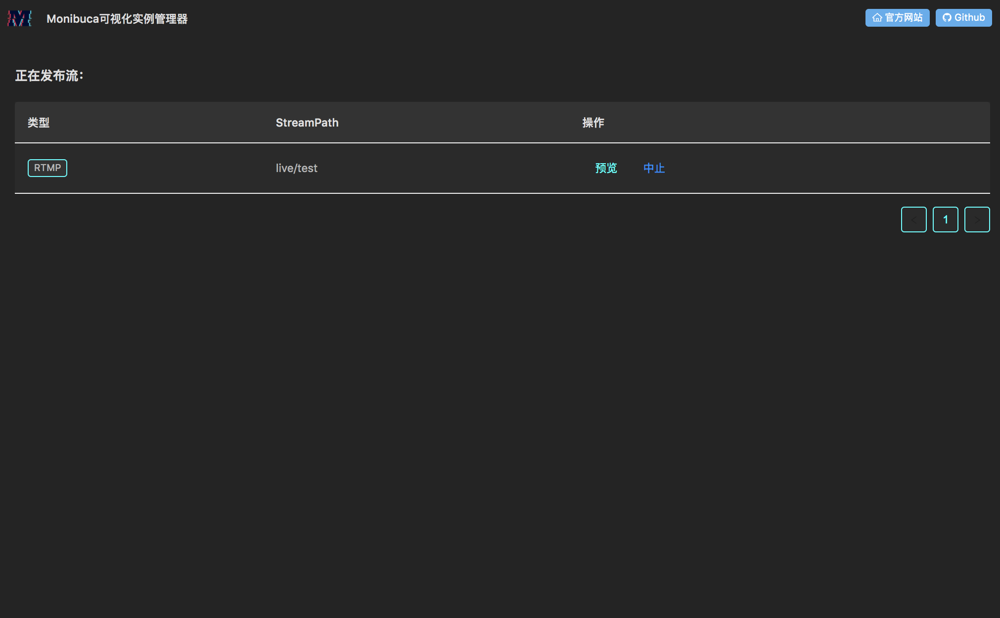

这说明我们用 `ffmpeg` 成功的把流推到了 **monibuca** 上， **monibuca** 监听到后，会通知操作页面去展示该推流，并且提供 **预览** 和 **中止** 操作。

我们点击 **预览** 按钮，会出现下图所示的弹窗：

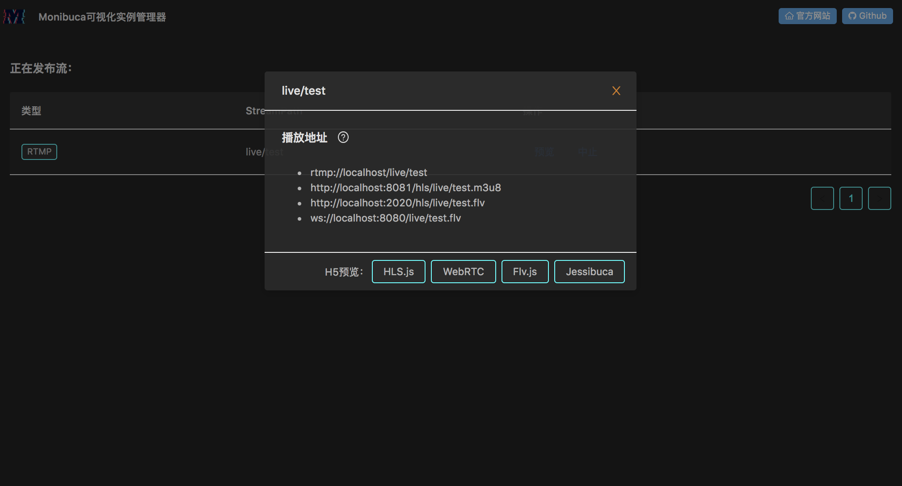

弹窗里面会展示播放地址，同时弹窗底部提供了各种模式的预览按钮，这里我们点击 **jessibuca** 按钮进行实时预览，如下图所示：

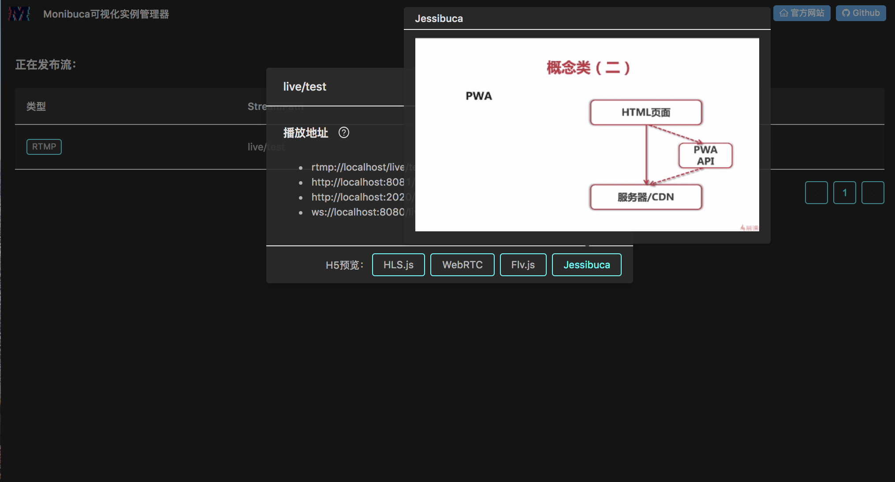

至此，我们完整的走完了环境搭建、实例创建、实例管理、实例操作的全流程，以及一个推流加实时预览的小案例，小伙伴们是不是非常心动哈，赶快按照此教程从头体验一遍哦。

## 尾牙

如果对上面的某些步骤不懂，或者卡在了某个步骤上，或者出现了不在此教程中谈到的问题，请通过扫码加入 `monibuca` 微信群，提出你的问题，我们一起解决和进步🌹

如何扫码：进入官网：[https://monibuca.com/](https://monibuca.com/) 即可看到右边有微信交流群二维码。
